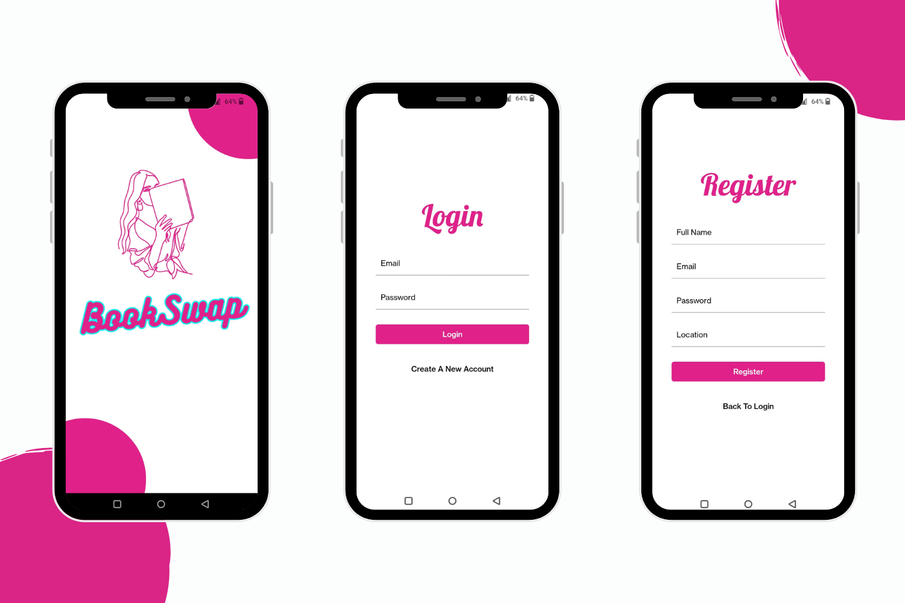
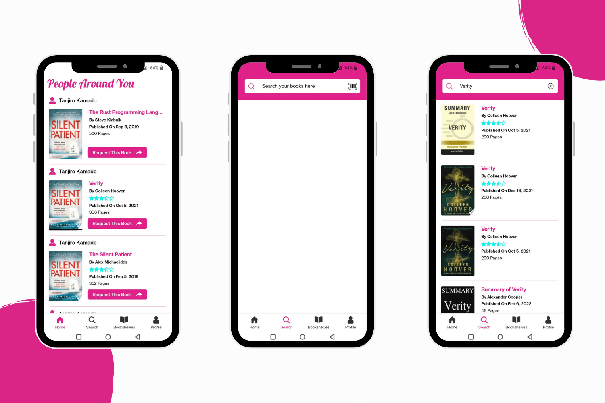
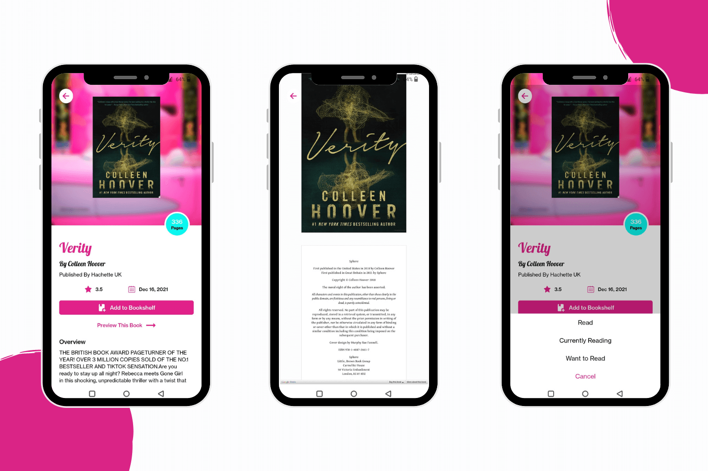
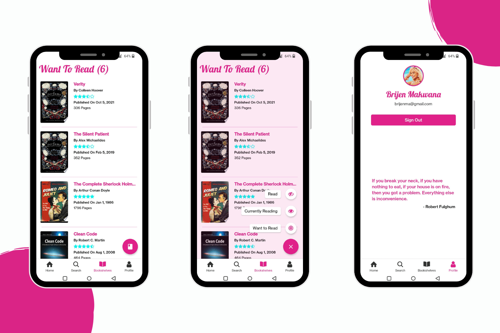
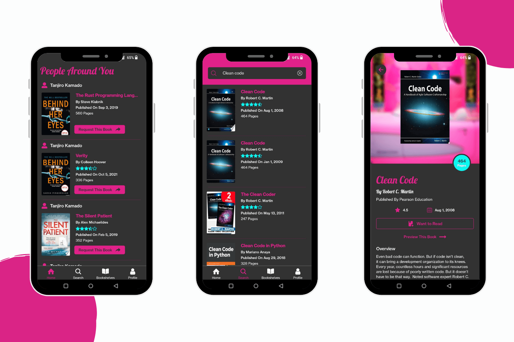
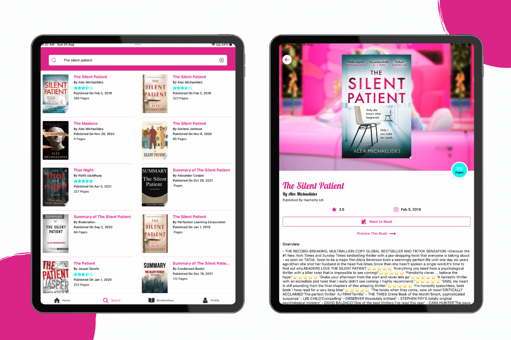
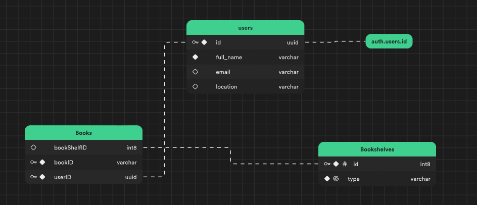

# BookSwap App : Design inspired by Barbie Movie

## Table of contents

- [Overview](#overview)
- [Screenshots](#screenshots)
- [Database Schema](#database-schema)
- [Run the project](#run-the-project)
- [Built with](#built-with)

## Overview

- Connects users to swap books with others in their city.
- Registration using email for seamless access implemented with Supabase Auth.
- Utilizes Google Books API for comprehensive book data.
- Offers detailed book information: title, image, rating, author, and description.
- Implements Google Embed API to preview books within the app.
- Users can search for any book by typing in the search bar.
- A barcode scanner has been implemented, allowing users to scan the barcode on any book and retrieve the book details.
- Provides 3 bookshelves to organize reading:
  - Read
  - Want to Read
  - Currently Reading
- Empowers users to add books to specific bookshelves, facilitating reading management.
- Supabase is used to perform all the CRUD operations and manage database.
- Home Screen displays a comprehensive view of available books and potential people to swap books with.
- Users can request books with a single button click.
- Email template auto-populates for efficient communication.
- Developed using the latest Expo version of React Native.

## Screenshots

<div>
  
  
  
  
  
  

</div>

## Database Schema

<div>
  
</div>

## Run the project

First you need to have node and Android Studio install in your machine to run this project and app.
Clone this project and open it on any Code Editor or IDE.
Then run this command.

```
npm i
```

It will install all the dependencies in your system. Then run this command to start the server.

```
npm start
```

Now you can view this app on your Android smartphone or Android Emulator

## Built with

- React Native
- Expo 49
- Typescript
- expo-router
- Supabase Database
- Google Books API
- Google Embed API
- expo-barcode-scanner
- Shopify Flashlist
- Styled Components
